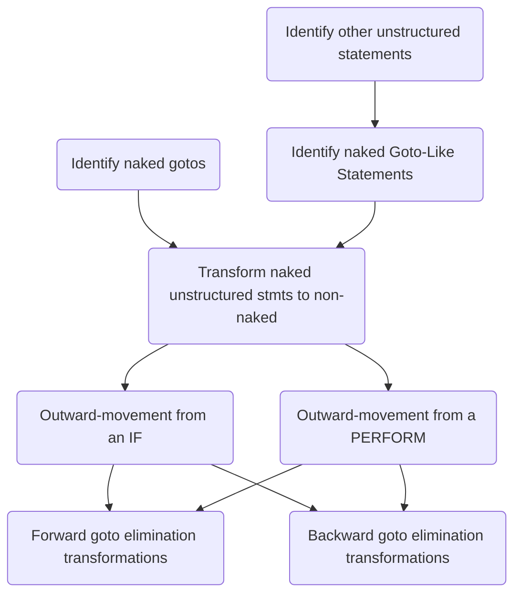

# Decomposing GoTo Work
- Identify other unstructured statements beyond gotos (non-returning guards normalization: STOP RUN, PERFORM ... STOP RUN combination, etc.).
- Identify naked gotos.
- Identify other naked unstructured statements.
- Transform naked unstructured statements to non-naked unstructured statements.
- Outward-movement transformation
  - Moving out from an `IF`.
  - Moving out from a `PERFORM ... UNTIL ...`.
- Goto Elimination transformations
  - Forward goto elimination.
  - Backward goto elimination.
  - Issues around goto targets being paragraphs
    1) How to properly "nest" the statements contained in a paragraph or section when doing a forward or backward goto elimination transformation,
    2) The source line ordering of paragraphs can be different than their execution order, and
    3) Fall through edges can cause implicit backward gotos.

