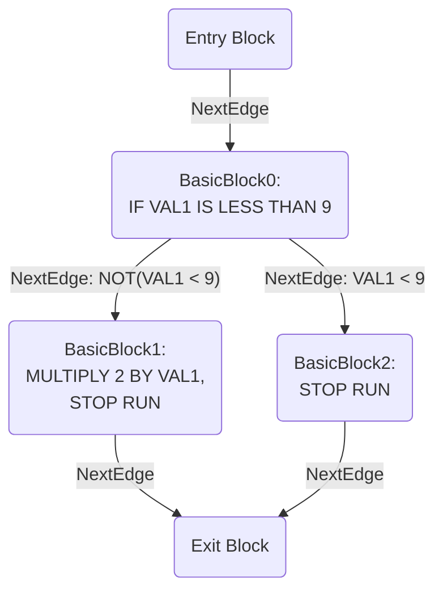
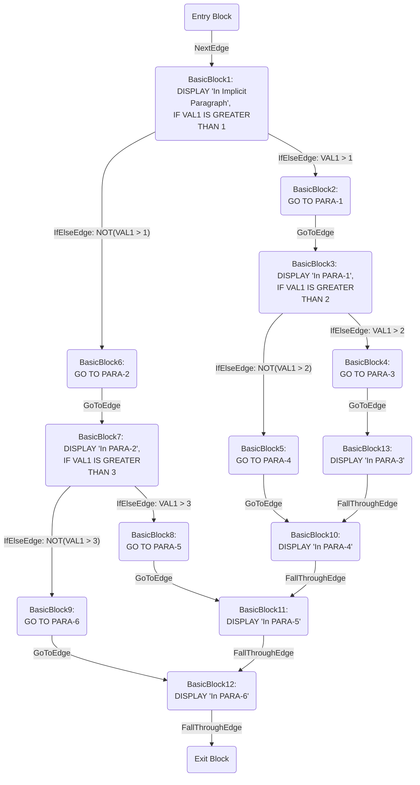

# Eliminating Goto Statements from COBOL
## Summary of *Taming Control Flow*

*Taming Control Flow: A Structured Approach to Eliminating Goto Statements (Erosa, et al.)* formalizes a procedure to eliminate all goto statements from a program. This is done by making the source conform to specific standards of structured programming. There are two categories of transformations that must be done to eliminate all goto statements from a program. These categories include:

- **Eliminating the goto statement**, and
- **Moving the goto statement** in preparation for elimination.

Only a subset of the transformations described in each category is relevant for eliminating gotos from COBOL programs. We will discuss the reasons for this shortly, but first we will give some important definitions (with examples) that will be used to define the transformations.

## Definitions

**Definition 0**: The *label* of a goto is a unique identifier used to specify the target of a goto statement. According to the semantics of COBOL, this label must be a paragraph or section name.

```cobol
00 PROCEDURE DIVISION.
01   IF VAL1 IS LESS THAN 9
02     GO TO PARA-1.
03
04 PARA-1.
05   MULTIPLY 2 BY VAL1.
```

In the above COBOL code, the goto statement on line `02` has the target labeled `PARA-1` located on line `04`. This means when the goto statement executes, control will pass to the beginning of `PARA-1` and start executing the statement at line `05`.

**Definition 1** A *dressed* goto is a goto that is nested inside the true branch of a conditional and it is the only statement inside that conditional. A dressed goto refers to both the conditional statement in which the goto is nested and the goto statement itself. For example, the following shows a dressed goto:

```cobol
00 PROCEDURE DIVISION.
01   IF VAL1 IS LESS THAN 9
02     GO TO PARA-1.
03
04 PARA-1.
05   MULTIPLY 2 BY VAL1.
```

Again, we consider `IF VAL1 IS LESS THAN 9 GO TO PARA-1.` to be the dressed goto. The following are not *dressed* gotos (*naked* gotos):

```cobol
00 PROCEDURE DIVISION.
01   GO TO PARA-1.
02
03 PARA-1.
04   MULTIPLY 2 BY VAL1.
```

and

```cobol
00 PROCEDURE DIVISION.
01   IF VAL1 IS LESS THAN 9
02     ADD 1 TO VAL1
03     GO TO PARA-1.
04
05 PARA-1.
06   MULTIPLY 2 BY VAL1.
```

and

```cobol
00 PROCEDURE DIVISION.
01   IF VAL1 IS LESS THAN 9
02     GO TO PARA-1
03     ADD 1 TO VAL1.
04
05 PARA-1.
06   MULTIPLY 2 BY VAL1.
```

**Note:** *Because we treat the conditional in which a goto is nested and the goto statement itself as a single unit, when we refer to a* goto *in the following definitions, we are referring to a* dressed *goto unless otherwise specified*

**Definition 2**: The *level* of a dressed goto or label is $m$ if the goto or label is nested inside exactly $m$ `loop`, `switch`, or `if/else` statements.

```cobol
00 PROCEDURE DIVISION.
01   IF VAL1 IS LESS THAN 9 GO TO PARA-1.
02
03 PARA-1.
04   MULTIPLY 2 BY VAL1.
```

In the above COBOL snippet, the dressed goto statement starting on line `01` has level = 0. In the following example, the goto has level = 1 because it is nested inside the `IF` statement on line `01`.

```cobol
00 PROCEDURE DIVISION.
01   IF VAL1 IS LESS THAN 100
02     IF VAL1 IS LESS THAN 9
03       GO TO PARA-1
04     END-IF
05   END-IF.
06
07 PARA-1.
08   MULTIPLY 2 BY VAL1.
```

The label `PARA-1` has level = 0. Labels in COBOL (i.e. paragraph or section names) will *always* have level = 0 because they cannot be directly nested inside other statements.

**Definition 3**: A goto and label are *siblings* if there exists some statement sequence, `stmt_1; ... ; stmt_n`, such that the label statement corresponds to some `stmt_i` and the goto statement corresponds to some `stmt_j` in the statement sequence. For COBOL it is equivalent to say a goto statement $g$ and label $l$ are *siblings* if and only if
$$level(g) = level(l) = 0$$

The following code snippets show examples of goto statements and labels that are siblings.

```cobol
00 PROCEDURE DIVISION.
01  ADD 1 TO VAL1.
02  IF VAL1 IS EQUAL TO 9
03    DIVIDE VAL1 BY 3 GIVING VAL1.
04  IF VAL1 IS GREATER THAN 99 GO TO PARA-1.
05  SUBTRACT 3 FROM VAL1.
06
07  PARA-1.
08    MULTIPLY 2 BY VAL1.
```

`04 IF VAL1 IS GREATER THAN 99 GO TO PARA-1.` and `07 PARA-1` are siblings.

```cobol
00 PROCEDURE DIVISION.
01  ADD 1 TO VAL1.
02  IF VAL1 IS EQUAL TO 9
03    DIVIDE VAL1 BY 3 GIVING VAL1.
04  IF VAL1 IS GREATER THAN 99 G0 TO PARA-2.
05  SUBTRACT 3 FROM VAL1.
06
07  PARA-1.
08    MULTIPLY 2 BY VAL1.
09
10  PARA-2.
11    ADD 3 TO VAL1.
```

`04 IF VAL1 IS GREATER THAN 99 G0 TO PARA-2.` and `10 PARA-2` are siblings.

```cobol
00 PROCEDURE DIVISION.
01  ADD 1 TO VAL1.
02  IF VAL1 IS EQUAL TO 9
03    DIVIDE VAL1 BY 3 GIVING VAL1.
04  SUBTRACT 3 FROM VAL1.
05
06  PARA-1.
07    MULTIPLY 2 BY VAL1.
08
09  PARA-2.
10    ADD 3 TO VAL1.
11    IF VAL IS LESS THAN 10 GO TO PARA-1.
```

`11 IF VAL IS LESS THAN 10 GO TO PARA-1.` and `06 PARA-1` are siblings.

The following code snippets show examples of goto statements and labels that are *not* siblings.

```cobol
00 PROCEDURE DIVISION.
01   IF VAL1 IS LESS THAN 100
02     IF VAL1 IS LESS THAN 9
03       GO TO PARA-1
04     END-IF
05   END-IF.
06
07 PARA-1.
08   MULTIPLY 2 BY VAL1.
```

The dressed goto starting on line `02` is *not* a sibling of `07 PARA-1.` because it has level = 1 as a result of being nested inside `01 IF VAL1 IS LESS THAN 100`.

```cobol
00 PROCEDURE DIVISION.
01  ADD 1 TO VAL1.
02  IF VAL1 IS EQUAL TO 9
03    SUBTRACT 3 FROM VAL1
04    GO TO PARA-1.
05
06  PARA-1.
07    MULTIPLY 2 BY VAL1.
```

`04 GO TO PARA-1` and `06 PARA-1` are *not* siblings because `04 GO TO PARA-1` is naked and has level = 1 as a result of being nested inside `02 IF VAL1 IS EQUAL TO 9` with statement `03 SUBTRACT 3 FROM VAL1`.

```cobol
00 PROCEDURE DIVISION.
01  ADD 1 TO VAL1.
02  IF VAL1 IS EQUAL TO 9
03    DIVIDE VAL1 BY 3 GIVING VAL1.
04  SUBTRACT 3 FROM VAL1.
05
06  PARA-1.
07    MULTIPLY 2 BY VAL1.
08
09  PARA-2.
10    IF VAL1 IS LESS THAN 99
11      GO TO PARA-1
12      ADD 3 TO VAL1.
```

`11 GO TO PARA-1` and `06 PARA-1` are *not* siblings because `11 GO TO PARA-1` is naked and has level = 1 as a result of being nested inside `10 IF VAL1 IS LESS THAN 99` along with statement `12 ADD 3 TO VAL1`.

**Definition 4**: A label statement and a goto statement are *directly-related* if there exists some statement sequence, `stmt_1; ... ; stmt_n`, such that either the label or goto statements corresponds to some `stmt_i` and the matching goto or label statement is nested inside some `stmt_j` in the statement sequence.

Because of the semantics of COBOL, a goto statement and a label will always be either *siblings* or *directly-related*. This is because it is impossible to nest a label (i.e. a paragraph or section name) inside another statement (such as an `IF`). Therefore, even though the goto and label are *not* siblings in the previous two code examples above, they *are* directly-related.

The *TCF* paper includes two other definitions—*offset* and *indirectly-related*—but neither is relevant to the semantics and structure of COBOL.

#### Summary of Relevant Points to COBOL
Although discussed above, it is useful to reiterate what parts of the definitions are relevant to COBOL and why. So in summary:
1) Labels in COBOL (i.e. paragraph or section names) will *always* have level = 0 because they cannot be directly nested inside statements (such as an `IF` statement).
2) Because of (1), a goto statement and a label will always be either *siblings* or *directly-related*.
If they are *siblings* then $$level(goto) = level(label) = 0$$
Otherwise they will be *directly-related* with $$level(label) = 0 \textrm{ and } level(goto)>0$$

Due to these restrictions to how COBOL handles goto statements and labels, only a subset of the transformations found in *TCF* are necessary. A discussion of the COBOL relevant transformations follows.

### Naked Goto Statements
As discussed above, a goto statement can be *naked* or *dressed*. A dressed goto is one in which it is nested inside the true branch of a conditional statement and that goto is the only statement nested inside that conditional. A naked goto is not a dressed goto. That is, it is a goto that is not  nested inside a conditional or it is not the only statement nested inside the conditional in which it is nested. If a goto is dressed, then we consider the goto and its nesting conditional as a single unit.

Because all the examples and transformations discussed in *TCF* assume the gotos are dressed, we will quickly review a procedure to transform  any naked goto into a dressed version. The transformation is simple:
- For every naked goto found in a program, transform it into a dressed goto by nesting it inside the true branch of a conditional statement in the form of `IF TRUE ... END-IF.`

A trivial example is one in which there is a single goto and label:

```cobol
00 PROCEDURE DIVISION.
01   GO TO PARA-1
02
03 PARA-1.
04   ADD 1 TO VAL1.

==Transformed to dressed goto==>

00 PROCEDURE DIVISION.
01   IF TRUE
02     GO TO PARA-1.
03
04 PARA-1.
05   ADD 1 TO VAL1.
```

The following examples shows how the transformation works when the goto is already nested inside a conditional statement but other statements are also nested inside:

```cobol
00 PROCEDURE DIVISION.
01   IF VAL1 IS LESS THAN 42
02     ADD 2 TO VAL1
03     GO TO PARA-1.
04
05 PARA-1.
06   ADD 1 TO VAL1.

==Transformed to dressed goto==>

00 PROCEDURE DIVISION.
01   IF VAL1 IS LESS THAN 42
02     ADD 2 TO VAL1
03     IF TRUE GO TO PARA-1 END-IF
04   END-IF.
05
06 PARA-1.
07   ADD 1 TO VAL1.
```

and

```cobol
00 PROCEDURE DIVISION.
01   IF VAL1 IS LESS THAN 42
02     GO TO PARA-1
03     ADD 2 TO VAL1.
04
05 PARA-1.
06   ADD 1 TO VAL1.

==Transformed to dressed goto==>

00 PROCEDURE DIVISION.
01   IF VAL1 IS LESS THAN 42
02     IF TRUE GO TO PARA-1 END-IF
03     ADD 2 TO VAL1
04   END-IF.
05
06 PARA-1.
07   ADD 1 TO VAL1.
```

and

```cobol
00 PROCEDURE DIVISION.
01   IF VAL1 IS LESS THAN 42
02     GO TO PARA-1
03   ELSE
04     ADD 2 TO VAL1
05   END-IF.
06
07 PARA-1.
08   ADD 1 TO VAL1.

==Transformed to dressed goto==>

00 PROCEDURE DIVISION.
01   IF VAL1 IS LESS THAN 42
02     IF TRUE GO TO PARA-1 END-IF
03   ELSE
04     ADD 2 TO VAL1
05   END-IF.
06
07 PARA-1.
08   ADD 1 TO VAL1.
```

The naked goto transformation will be referenced below when discussing the transformations defined in *TCF*.

### *TCF* Transformations
There are two categories of transformations outlined in *TCF*, those that **eliminate the goto statement** and those that **move the goto statement** by unnesting it from other statements in preparation for elimination. We will begin our discussion with the latter.

#### Moving Goto Statements by Unnesting
*TCF* defines two types of movement transformations that can be done on a goto statement:
1) **Outward-movement** transformations where a goto or label statement is unnested from and moved outside another statement such as a  `loop`, `switch`, or `if/else`. If $level(goto)>level(label)$ then a series of outward-movement transformations are done to decrease the level of the goto statement until $level(goto)=level(label)$
2) **Inward-movement** transformations where a goto or label statement is nested inside another statement such as a `loop`, `switch`, or `if/else`. If $level(goto)<level(label)$ then a series of inward-movement transformations are done to increase the level of the goto statement until $level(goto)=level(label)$.

Consistent with the discussion on applying the definitions to COBOL in the previous section, inward-movement transformations can be ignored; they are not relevant to COBOL programs. Recall that not only will it *always* be the case for every COBOL program that

$$level(goto) \geqslant level(label),$$

it will also always be true that

$$level(label) = 0.$$

Thus, *the only movement transformation we need in eliminating gotos from a COBOL program is the outward-movement transformation*. Furthermore, the goal of these outward-movement transformations is to make the COBOL goto and target label (the paragraph or section name) *siblings* with

$$level(goto) = level(label) = 0.$$

#### Outward-movement Transformations in COBOL

There are two basic statements from which gotos can be unnested and moved out to a lower level. These are from inside `IF ... ELSE ...` statements and  `PERFORM ... UNTIL ...` statements (the standard looping structure in COBOL).

##### Moving Goto Outside an IF Statement

The same basic approach is used if the goto is nested inside an `IF ... ELSE ...` statement or `PERFORM ... UNTIL ...` statement:
- identify the guard expression inside the dressed goto or the conditional in which the dressed goto is nested inside,
- assign a boolean variable the value of that guard expression,
- place this assignment statement right before the nesting statement, and
- move the goto down one level by pulling it out of the statement it's nested in.

A simple example follows.

```cobol
00 PROCEDURE DIVISION.
01   IF VAL1 IS LESS THAN 100
02     IF VAL1 IS LESS THAN 9
03       GO TO PARA-1
04     END-IF
05   END-IF
06   COMPUTE VAL1 = VAL1 + 1.
07
08 PARA-1.
09   MULTIPLY 2 BY VAL1.

==First create cond_1 on line 02 from the dressed 
  goto guard expression==>

00 PROCEDURE DIVISION.
01   IF VAL1 IS LESS THAN 100
02     cond_1 = VAL1 IS LESS THAN 9
03     IF cond_1 GO TO PARA-1 END-IF
04   END-IF.
05   COMPUTE VAL1 = VAL1 + 1.
06
07 PARA-1.
08   MULTIPLY 2 BY VAL1.
```

We can see the dressed goto starts on top line `02` and contains the guard expression `VAL1 IS LESS THAN 9`. So we first create a boolean variable `cond_1` at bottom line `02` and assign this expression.

**Note:** *The introduction of this `cond_1` value is not valid COBOL. Here we used a simplified notation, but COBOL does not include boolean valued variables. Level 88 variables are often used to serve this function and the actual implementation of the outward-movement transformation will have to do something similar.* See the discussion below in **COBOL Does Not Have Boolean Valued Variables**

We can now move the dressed goto outside the outer conditional by creating a similar boolean valued variable, assigning it the outer conditional's guard expression, conjuncting this boolean valued variable to the dressed goto's guard expression, and moving the goto out one level:

```cobol
00 PROCEDURE DIVISION.
01   IF VAL1 IS LESS THAN 100
02     cond_1 = VAL1 IS LESS THAN 9
03     IF cond_1 GO TO PARA-1 END-IF
04   END-IF.
05   COMPUTE VAL1 = VAL1 + 1.
06
07 PARA-1.
08   MULTIPLY 2 BY VAL1.

==Now create cond_2 on line 01 and move out the goto==>

00 PROCEDURE DIVISION.
01   cond_2 = VAL1 IS LESS THAN 100
02   IF VAL1 IS LESS THAN 100
03     cond_1 = VAL1 IS LESS THAN 9
04   END-IF
05   IF cond_1 AND cond_2 GO TO PARA-1.
06   COMPUTE VAL1 = VAL1 + 1.
07
08 PARA-1.
09   MULTIPLY 2 BY VAL1.
```

Here we can see the original program on top with the equivalent version after completing the transformation on bottom:

```cobol
00 PROCEDURE DIVISION.
01   IF VAL1 IS LESS THAN 100
02     IF VAL1 IS LESS THAN 9
03       GO TO PARA-1
04     END-IF
05   END-IF
06   COMPUTE VAL1 = VAL1 + 1.
07
08 PARA-1.
09   MULTIPLY 2 BY VAL1.

==Fully transforms to==>

00 PROCEDURE DIVISION.
01   cond_2 = VAL1 IS LESS THAN 100
02   IF VAL1 IS LESS THAN 100
03     cond_1 = VAL1 IS LESS THAN 9
04   END-IF
05   IF cond_1 AND cond_2 GO TO PARA-1.
06   COMPUTE VAL1 = VAL1 + 1.
07
08 PARA-1.
09   MULTIPLY 2 BY VAL1.
```

This concludes the steps involved in the outward-movement transformation of the goto included in this example. How we use the variable `cond_1` and `cond_2` that we introduced or what we do with the statement on below line `06` after the goto but before the label will be discussed when explaining the goto elimination transformations. Until then, let's look at another example that uses a  `PERFORM ... UNTIL ...` to nest a goto.

##### Moving Goto Outside a PERFORM Statement

Consider the following example.

```cobol
00 PROCEDURE DIVISION.
01   PERFORM UNTIL VAL1 IS GREATER THAN 10
02     GO TO PARA-1.
03   COMPUTE VAL1 = VAL1 + 1.
04
05 PARA-1.
06   MULTIPLY 2 BY VAL1.
```

Notice the goto on line `02` is naked. So lets first correct that:

```cobol
00 PROCEDURE DIVISION.
01   PERFORM UNTIL VAL1 IS GREATER THAN 10
02     GO TO PARA-1.
03   COMPUTE VAL1 = VAL1 + 1.
04
05 PARA-1.
06   MULTIPLY 2 BY VAL1.

==Make naked goto dressed==>

00 PROCEDURE DIVISION.
01   PERFORM UNTIL VAL1 IS GREATER THAN 10
02     IF TRUE GO TO PARA-1 END-IF.
03   COMPUTE VAL1 = VAL1 + 1.
04
05 PARA-1.
06   MULTIPLY 2 BY VAL1.
```

Now apply the outward movement transformation from the loop structure to get:

```cobol
00 PROCEDURE DIVISION.
01   PERFORM UNTIL VAL1 IS GREATER THAN 10
02     IF TRUE GO TO PARA-1 END-IF.
03   COMPUTE VAL1 = VAL1 + 1.
04
05 PARA-1.
06   MULTIPLY 2 BY VAL1.

==Transforms to==>

00 PROCEDURE DIVISION.
01   cond_2 = VAL1 IS GREATER THAN 10
02   PERFORM UNTIL VAL1 IS GREATER THAN 10
03     cond_1 = TRUE
04     IF cond_1 break.
05   END-PERFORM.
06   IF cond_1 AND NOT(cond_2) GO TO PARA-1 END-IF.
07   COMPUTE VAL1 = VAL1 + 1.
08
09 PARA-1.
10   MULTIPLY 2 BY VAL1.
```

Just as in the `IF ... Else ...` statement, we identify the guard expression guarding the goto statement, assign to a boolean variable the value of that guard expression, and move the goto outside the statement in which it was originally nested. Movement outside a `PERFORM` differs from `IF ... ELSE ...`, however, because we must place at the original location of the dressed goto a `break` statement that is inside a conditional guarded by the dressed goto's guard expression.

**Note:** *COBOL does not contain a* `break` *statement. We can, however, use a non-COBOL construct during our compilation process into our FOM-ready representation. That is, we can insert a statement (or flag, if you wish) that tells the FOM transpiler to create a FOM break statement inside the relevant branch of the conditional. This will maintain equivalence to the original COBOL source while side-stepping a more complicated transformation.*

##### Outward-movement Transformations for Multiple Levels of Nesting

The above outward-movement process can be done recursively for any level of nesting until $level(goto) = 0$ as can be seen in the following example.

```cobol
00 PROCEDURE DIVISION.
01   IF VAL1 IS LESS THAN 0
02     SUBTRACT VAL1 FROM VAL1
03     IF VAL1 IS EQUAL TO 0
04       MOVE 9 TO VAL1
05       GO TO PARA-1
06     END-IF
07   END-IF.
08   COMPUTE VAL1 = VAL1 + 1.
09
10 PARA-1.
11   MULTIPLY 2 BY VAL1.

==Transforms to==>

00 PROCEDURE DIVISION.
01   cond_3 = VAL1 IS LESS THAN 0.
02   IF VAL1 IS LESS THAN 0
03     SUBTRACT VAL1 TO VAL1
04     cond_2 = VAL1 IS EQUAL TO 0
05     IF VAL1 IS EQUAL TO 0
06       MOVE 9 TO VAL1
07       cond_1 = TRUE
08     END-IF
09   END-IF.
10   IF cond_1 AND cond_2 and cond_3 GO TO PARA-1.
11   COMPUTE VAL1 = VAL1 + 1.
12
13 PARA-1.
14   MULTIPLY 2 BY VAL1.
```

#### Goto Elimination Transformations
Once the goto has been completely unnested (i.e. $level(goto)=level(label)=0$) using the outward-movement transformations we are ready to eliminate the goto statement. There are two such transformations depending on how the goto and its target label are ordered *according to the execution of those statements*. Execution order will become relevant shortly, but let us first describe the two transformations. These transformations are
1) **Forward goto transformation** where a goto that is before its target label according to the execution order of the program is eliminated, and
2) **Backward goto transformation** where a goto that is after its target label according to the execution order of the program is eliminated.

##### Forward Goto Transformation
The basic procedure of either elimination transformations is to
1) Find the statements that are between the goto and its target label according to the execution order of the program.
2) Nest those statements into the appropriate COBOL control flow statement while preserving equivalence to the original program

Consider the following example where a forward goto is eliminated

```cobol
00 PROCEDURE DIVISION.
01   IF VAL1 IS LESS THAN 9
02     GO TO PARA-1.
03   COMPUTE VAL1 = VAL1 + 1.
04
05 PARA-1.
06   MULTIPLY 2 BY VAL1.

==Outward movement transformation==>

00 PROCEDURE DIVISION.
01   cond_1 = VAL1 IS LESS THAN 9.
02   IF VAL1 IS LESS THAN 9.
03   IF cond_1 GO TO PARA-1.
04   COMPUTE VAL1 = VAL1 + 1.
05
06 PARA-1.
07   MUTIPLY 2 BY VAL1.
```

First the goto is moved outward using an outward-movement transformation

```cobol
00 PROCEDURE DIVISION.
01   cond_1 = VAL1 IS LESS THAN 9.
02   IF VAL1 IS LESS THAN 9.
03   IF cond_1 GO TO PARA-1.
04   COMPUTE VAL1 = VAL1 + 1.
05
06 PARA-1.
07   MUTIPLY 2 BY VAL1.

==Eliminate goto==>

00 PROCEDURE DIVISION.
01   cond_1 = VAL1 IS LESS THAN 9.
02   IF VAL1 IS LESS THAN 9.
03   IF NOT(cond_1)
04     COMPUTE VAL1 = VAL1 + 1.
05   IF cond_1 GO TO PARA-1.
06
07 PARA-1.
08   MUTIPLY 2 BY VAL1.
```

Then the goto is eliminated by first collecting the statements between the goto on top line `03` and the label `PARA-1` on line `06`. There is only one such statement on line `04`: `COMPUTE VAL1 = VAL1 + 1`. We then create a new `IF` statement with the negation of the boolean variable `cond_1` on line `01` (created during the outward-movement transformation) as the guard expression. We then nest the collected statements (here only `COMPUTE VAL1 = VAL1 + 1`) inside the true branch of that created `IF` statement. We can now simply remove the goto at bottom line `05`, eliminating it from the program. An optional cleanup step in this particular example is to also removing the `IF` at bottom line `02` since it contains no other statements. As we will see, if it *did* contain other statements this cleanup step would not be possible.

Here we can see the original program on the top and the goto-free, cleaned up version on the bottom.

```cobol
00 PROCEDURE DIVISION.
01   IF VAL1 IS LESS THAN 9
02     GO TO PARA-1.
03   COMPUTE VAL1 = VAL1 + 1.
04
05 PARA-1.
06   MULTIPLY 2 BY VAL1.

==Fully transformed==>

00 PROCEDURE DIVISION.
01   cond_1 = VAL1 IS LESS THAN 9.
02   IF NOT(cond_1)
03     COMPUTE VAL1 = VAL1 + 1.
04
05 PARA-1.
06   MUTIPLY 2 BY VAL1.
```

These two programs are equivalent w.r.t. how the program transforms information.

This procedure of forward goto elimination is the same for any amount of outward-movement transformations that may be  required. It is also the same for any number or type of statements that exist between the goto and its target label according to the execution order of the program:

```cobol
00 PROCEDURE DIVISION.
01   IF VAL1 IS LESS THAN 0
02     SUBTRACT VAL1 FROM VAL1
03     IF VAL1 IS EQUAL TO 0
04       MOVE 9 TO VAL1
05       GO TO PARA-1
06     END-IF
07   END-IF.
08   IF VAL1 IS GREATER THAN 8
09     ADD VAL1 TO VAL1.
10   COMPUTE VAL1 = VAL1 + 1.
11
12 PARA-1.
13    MULTIPLY 2 BY VAL1.

==Fully transformed==>

00 PROCEDURE DIVISION.
01   cond_3 = VAL1 IS LESS THAN 0.
02   IF VAL1 IS LESS THAN 0
03     SUBTRACT VAL1 FROM VAL1
04     cond_2 = VAL1 IS EQUAL TO 0
05     IF VAL1 IS EQUAL TO 0
06       MOVE 9 TO VAL1
07       cond_1 = TRUE
08     END-IF
09   END-IF.
10   IF NOT(cond_1) OR NOT(cond_2) OR NOT(cond_3)
11     IF VAL1 IS GREATER THAN 8
12       ADD VAL1 TO VAL1
13     END-IF
14     COMPUTE VAL1 = VAL1 + 1
15   END-IF.
16
17 PARA-1.
18   MULTIPLY 2 BY VAL1.
```

If more than one outward-movement transformation was done to completely unnest the goto, the guard expression for the created `IF` statement on bottom line `10` becomes the disjunction of the negation of each of the boolean variables (`cond_1`, `cond_2`, and `cond_3` in this case).

**Note:** *If the boolean variable was created by unnesting from a `PERFORM ... UNTIL ... ` statement, then the guard disjunction will include that variable *not* negated*. For example, say we have `cond_2` created by an outward-movement transformation from an `IF` statement and `cond_3` created by an outward-movement transformation from a `PERFORM ... UNTIL ...` statement. Our `IF` statement created during the forward goto elimination transformation will look like this: `IF NOT(cond_1) OR NOT(cond_2) OR cond_3`. We now return to our original example.

Notice that we cannot cleanup by removing the `IF` statements on bottom lines `02` and `05` in which the goto was originally nested. They included other statement (lines `03` and  `06`) the removal of which would change the semantics from the original program.

Furthermore, forward goto elimination must be done recursively, using a combination of outward-movement and forward goto elimination transformations for each level of nesting out of which the goto is pulled. For example,

```cobol
00 PROCEDURE DIVISION.
01   IF VAL1 IS LESS THAN 0
02     SUBTRACT VAL1 FROM VAL1
03     IF VAL1 IS EQUAL TO 0
04       MOVE 9 TO VAL1
05       GO TO PARA-1
06     ELSE
07       MOVE 200 TO VAL1
08     END-IF
09     DISPLAY 'Hello, reader'
10   END-IF.
11   IF VAL1 IS GREATER THAN 8
12     ADD VAL1 TO VAL1.
13   COMPUTE VAL1 = VAL1 + 1.
14
15 PARA-1.
16   MULTIPLY 2 BY VAL1.

==Transformed first layer==>

00 PROCEDURE DIVISION.
01   IF VAL1 IS LESS THAN 0
02     SUBTRACT VAL1 FROM VAL1
03     cond_2 = VAL1 IS EQUAL TO 0
04     IF VAL1 IS EQUAL TO 0
05       MOVE 9 TO VAL1
06       cond_1 = true
07     ELSE
08       MOVE 200 TO VAL1
09     END-IF
10     IF NOT(cond_1) AND NOT(cond_2)
11       DISPLAY 'Hello, reader'
12     END-IF
13     IF cond_1 AND cond_2 GO TO PARA-1 END-IF
14   END-IF.
15   IF VAL1 IS GREATER THAN 8
16     ADD VAL1 TO VAL1.
17   COMPUTE VAL1 = VAL1 + 1.
18
19 PARA-1.
20    MULTIPLY 2 BY VAL1.
```

We can see in this example that the goto on top line `05` is nested inside the true branch of the `IF` statement on top line `03`, which is nested inside the true branch of the `IF` statement on top line `01`. We can also see that there is a statement at top line `09` that ends the true branch of the top line `01` statement after the nested conditional statement on top line `03`. We can see on the bottom that this statement `DISPLAY 'Hello, reader'` gets nested inside the true branch of the condition guarded by the negation of `cond_1` and `cond_2`, which can be seen on bottom line `10`. The goto is now the last statement on bottom line `13` the true block of the outer `IF` statement on bottom line `01`.

```cobol
00 PROCEDURE DIVISION.
01   IF VAL1 IS LESS THAN 0
02     SUBTRACT VAL1 FROM VAL1
03     cond_2 = VAL1 IS EQUAL TO 0
04     IF VAL1 IS EQUAL TO 0
05       MOVE 9 TO VAL1
06       cond_1 = true
07     ELSE
08       MOVE 200 TO VAL1
09     END-IF
10     IF NOT(cond_1) AND NOT(cond_2)
11       DISPLAY 'Hello, reader'
12     END-IF
13     IF cond_1 AND cond_2 GO TO PARA-1 END-IF
14   END-IF.
15   IF VAL1 IS GREATER THAN 8
16     ADD VAL1 TO VAL1.
17   COMPUTE VAL1 = VAL1 + 1.
18
19 PARA-1.
20    MULTIPLY 2 BY VAL1.

==Goto moved out another layer and made ready for elimination==>

00 PROCEDURE DIVISION.
01   cond_3 = VAL1 IS LESS THAN 0
02   IF VAL1 IS LESS THAN 0
03     SUBTRACT VAL1 FROM VAL1
04     cond_2 = VAL1 IS EQUAL TO 0
05     IF VAL1 IS EQUAL TO 0
06       MOVE 9 TO VAL1
07       cond_1 = true
08     ELSE
09       MOVE 200 TO VAL1
10     END-IF
11     IF NOT(cond_1) AND NOT(cond_2)
12       DISPLAY 'Hello, reader'
13     END-IF
14   END-IF.
15   IF NOT(cond_1) AND NOT(cond_2) AND NOT(cond_3)
16     IF VAL1 IS GREATER THAN 8
17       ADD VAL1 TO VAL1
18     END-IF
19     COMPUTE VAL1 = VAL1 + 1
20   END-IF.
21   IF cond_1 AND cond_2 AND cond_3 GO TO PARA-1.
22
23 PARA-1.
24   MULTIPLY 2 BY VAL1.
```

Once again, the outward-movement transformation is applied to the goto statement top line `13`. Next, the `IF` statement on bottom line `15` is created with the negated disjunction of created boolean variables as the guard expression and the collected statements nested inside the true branch. Finally, the goto statement is moved right next to its target label at bottom line `21`. We can now safely eliminate the goto statement.

```cobol
00 PROCEDURE DIVISION.
01   IF VAL1 IS LESS THAN 0
02     SUBTRACT VAL1 FROM VAL1
03     IF VAL1 IS EQUAL TO 0
04       MOVE 9 TO VAL1
05       GO TO PARA-1
06     ELSE
07       MOVE 200 TO VAL1
08     END-IF
09     DISPLAY 'Hello, reader'
10   END-IF.
11   IF VAL1 IS GREATER THAN 8
12     ADD VAL1 TO VAL1.
13   COMPUTE VAL1 = VAL1 + 1.
14
15 PARA-1.
16   MULTIPLY 2 BY VAL1.

==Fully transformed==>

00 PROCEDURE DIVISION.
01   cond_3 = VAL1 IS LESS THAN 0
02   IF VAL1 IS LESS THAN 0
03     SUBTRACT VAL1 FROM VAL1
04     cond_2 = VAL1 IS EQUAL TO 0
05     IF VAL1 IS EQUAL TO 0
06       MOVE 9 TO VAL1
07       cond_1 = true
08     ELSE
09       MOVE 200 TO VAL1
10     END-IF
11     IF NOT(cond_1) AND NOT(cond_2)
12       DISPLAY 'Hello, reader'
13     END-IF
14   END-IF.
15   IF NOT(cond_1) AND NOT(cond_2) AND NOT(cond_3)
16     IF VAL1 IS GREATER THAN 8
17       ADD VAL1 TO VAL1
18     END-IF
19     COMPUTE VAL1 = VAL1 + 1
20   END-IF.
21
22 PARA-1.
23   MULTIPLY 2 BY VAL1.
```

Here we can see original program on the top with the fully transformed version on the bottom with the goto eliminated.

##### Backward Goto Transformation
To reiterate, the basic procedure of either elimination transformations is to
1) Find the statements that are between the goto and its target label according to the execution order of the program.
2) Nest those statements into the appropriate COBOL control flow statement while preserving equivalence to the original program.

In the forward goto elimination transformation, the appropriate COBOL control flow statement was an `IF` statement. When we are dealing with a backward goto, the appropriate COBOL control flow statement is a `PERFORM ... UNTIL ... WITH TEST AFTER`. This is COBOL's `do ... while ...` implementation. The same behavior can, however, be implemented with a regular `PERFORM ... UNTIL` by clever use of boolean valued variables to ensure the body of the loop is executed at least once. This method will be discussed in a later section. Here is a small example demonstrating backward goto elimination with use of a `PERFORM ... UNTIL ... WITH TEST AFTER`. 

```cobol
00 PROCEDURE DIVISION.
01   PERFORM PARA-1.
02   STOP RUN.
03
04 PARA-1.
05   MULTIPLY 2 BY VAL1.
06   IF VAL1 IS LESS THAN 9
07     GO TO PARA-1.

==Unnest the goto==>

00 PROCEDURE DIVISION.
01   PERFORM PARA-1.
02   STOP RUN.
03
04 PARA-1.
05   MULTIPLY 2 BY VAL1.
06   cond_1 = VAL1 IS LESS THAN 9
07   IF VAL1 IS LESS THAN 9
08   IF cond_1 GO TO PARA-1.
```

We can see on bottom lines `06` through `08`, the goto has been unnested from the conditional statement using an outward-movement transformation.

```cobol
00 PROCEDURE DIVISION.
01   PERFORM PARA-1.
02   STOP RUN.
03
04 PARA-1.
05   MULTIPLY 2 BY VAL1.
06   cond_1 = VAL1 IS LESS THAN 9
07   IF VAL1 IS LESS THAN 9
08   IF cond_1 GO TO PARA-1.

==Transforms to==>

00 PROCEDURE DIVISION.
01   PERFORM PARA-1.
02   STOP RUN.
03
04 PARA-1.
05   IF cond_1 GO TO PARA-1.
06   PERFORM UNTIL NOT(cond_1) WITH TEST AFTER
07     MULTIPLY 2 BY VAL1
08     cond_1 = VAL1 IS LESS THAN 9
09     IF VAL1 IS LESS THAN 9
```

Then the statements on top lines `05` through `07` are collected and nested inside the body of the `PERFORM UNTIL NOT(cond_1) WITH TEST AFTER` on bottom line `06`. For the guard expression, `cond_1` is the boolean variable created during the outward-movement transformation on top line `06`.

The goto statement can now be eliminated and the conditional statement on bottom line `09` safely removed (again, because both the true block and false block of that conditional statement are now empty). The original program with the final eliminated goto version can be seen below.

```cobol
00 PROCEDURE DIVISION.
01   PERFORM PARA-1.
02   STOP RUN.
03
04 PARA-1.
05   MULTIPLY 2 BY VAL1.
06   IF VAL1 IS LESS THAN 9.
07     GO TO PARA-1.

==Transforms to==>

00 PROCEDURE DIVISION.
01   PERFORM PARA-1.
02   STOP RUN.
03
04 PARA-1.
05   PERFORM UNTIL NOT(cond_1) WITH TEST AFTER
06     MULTIPLY 2 BY VAL1
07     cond_1 = VAL1 IS LESS THAN 9
08     IF VAL1 IS LESS THAN 9
```

Just as in the forward goto elimination transformation, multiple outward-movement transformations can be required to unnest the goto from several statements before completing the backward goto elimination transformation:

```cobol
00 PROCEDURE DIVISION.
01   PERFORM PARA-1.
02   STOP RUN.
03
04 PARA-1.
05   PERFORM UNTIL VAL1 IS GREATER THAN 20
06     MULTIPLY 2 BY VAL1
07     IF VAL1 IS LESS THAN 10
08       MOVE 10 TO VAL1
09       GO TO PARA-1
10     END-IF
11   END-PERFORM.

==Transforms to==>

00 PROCEDURE DIVISION.
01   PERFORM PARA-1.
02   STOP RUN.
03
04 PARA-1.
05   PERFORM UNTIL NOT(cond_1)
06              OR NOT(cond_2)
07              OR cond_3 WITH TEST AFTER
08     cond_3 = VAL1 IS GREATER THAN 20
09     PERFORM UNTIL VAL1 IS GREATER THAN 20
10       MULTIPLY 2 BY VAL1
11       cond_2 = VAL1 IS LESS THAN 10
12       IF VAL1 IS LESS THAN 10
13         MOVE 10 TO VAL1
14         cond_1 = TRUE
15         IF cond_1 break
16       END-IF
17     END-PERFORM
18   END-PERFORM.
```

Again, note that `cond_1` and `cond_2` are negated in our created disjunction guard in the statement on below line `05` and `cond_3` is not negated. This is because `cond_1` and `cond_2` were created by moving the goto out of an `IF` statement and `cond_3` was created by moving the goto out of a `PERFORM ... UNTIL ...` statement.

## Other Considerations When Applying *TCF* to COBOL Source
We have now completed the basic application of the *TCF* paper to COBOL. What follows is a discussion of specific issues that must be considered when applying *TCF* to our work at Phase Change. This includes specific design and implementation options and choices that must be made to easily transform the COBOL source code into a FOM representation.

### Backward Goto Elimination Transformation Using Regular Loops and a "Do at Least Once" Variable.
In the discussion of eliminating backward gotos, we used COBOL do-while construct, the `PERFORM ... UNTIL ... WITH TEST AFTER`. While the semantics are slightly different from a usual do-while, the `PERFORM ... UNTIL .. WITH TEST AFTER` has the key feature of testing the guard expression at the end of the loop iteration. Unfortunately, FOM does not have a do-while statement. Thus, to best prepare the original COBOL program for FOM translation, we can use a regular `PERFORM ... UNTIL ...` loop and strategically create a boolean variable, conjunctioning it to the `PERFORM ... UNTIL ...` guard to ensure we enter the loop at least once. Consider our example from above:

```cobol
00 PROCEDURE DIVISION.
01   PERFORM PARA-1.
02   STOP RUN.
03
04 PARA-1.
05   MULTIPLY 2 BY VAL1.
06   IF VAL1 IS LESS THAN 9.
07     GO TO PARA-1.

==Transformation using do-while==>

00 PROCEDURE DIVISION.
01   PERFORM PARA-1.
02   STOP RUN.
03
04 PARA-1.
05   PERFORM UNTIL NOT(cond_1) WITH TEST AFTER
06     MULTIPLY 2 BY VAL1
07     cond_1 = VAL1 IS LESS THAN 9

==Transformation using regular loop and 
	  do_at_least_once variable==>

00 PROCEDURE DIVISION. 
01   PERFORM PARA-1. 
02   STOP RUN.
03
04 PARA-1.
05   do_at_least_once = TRUE
06   PERFORM UNTIL NOT(do_at_least_once) AND NOT(cond_1) 
07     do_at_least_once = FALSE
08     MULTIPLY 2 BY VAL1
09     cond_1 = VAL1 IS LESS THAN 9
```

The middle transformation uses COBOL's do-while statement on middle line `05`. In the bottom transformation we can see the `do_at_least_once` variable assigned `TRUE` on bottom line `05`. It's negation is then added to the created `PERFORM ... UNTIL ...` on bottom line `06` along with `cond_1` on bottom line `09` that was created during the outward-movement transformation. We then assign `do_at_least_once` the value `FALSE` as the first statement inside the loop body at bottom line `07`. This ensures we execute the loop body at least once before checking `cond_1` during subsequent iterations. This captures the same behavior as a do-while loop.

**Note:** *We are not suggesting that the implementation of this transformation produce the do-while version first before producing the regular loop version. The point is, however it is done, a regular loop version can be produced that captures the same behavior. Both the do-while and regular loop transformations are included in these examples for understanding purposes only.*

The same can be done for any level of nesting/complexity that exists in the program. For example,

```cobol
00 PROCEDURE DIVISION.
01   PERFORM PARA-1.
02   STOP RUN.
03
04 PARA-1.
05   PERFORM UNTIL VAL1 IS GREATER THAN 20
06     MULTIPLY 2 BY VAL1
07     IF VAL1 IS LESS THAN 10
08  MOVE 10 TO VAL1
09       GO TO PARA-1
10     END-IF
11   END-PERFORM.

==Transformation using do-while==>

00 PROCEDURE DIVISION.
01   PERFORM PARA-1.
02   STOP RUN.
03
04 PARA-1.
05   PERFORM UNTIL NOT(cond_1)
06              OR NOT(cond_2)
07              OR cond_3 WITH TEST AFTER
08     cond_3 = VAL1 IS GREATER THAN 20
09     PERFORM UNTIL VAL1 IS GREATER THAN 20
10       MULTIPLY 2 BY VAL1
11       cond_2 = VAL1 IS LESS THAN 10
12       IF VAL1 IS LESS THAN 10
13         MOVE 10 TO VAL1
14         cond_1 = TRUE
15        IF cond_1 break
16       END-IF
17     END-PERFORM
18   END-PERFORM.

==Transformation using regular loop==>

00 PROCEDURE DIVISION.
01   PERFORM PARA-1.
02   STOP RUN.
03
04 PARA-1.
05   do_at_least_once = TRUE
06   PERFORM UNTIL NOT(TRUE) 
07             AND (NOT(cond_1)
08              OR NOT(cond_2)
09              OR cond_3) WITH TEST AFTER
10      do_at_least_once = FALSE
11     cond_3 = VAL1 IS GREATER THAN 20
12     PERFORM UNTIL VAL1 IS GREATER THAN 20
13       MULTIPLY 2 BY VAL1
14       cond_2 = VAL1 IS LESS THAN 10
15       IF VAL1 IS LESS THAN 10
16         MOVE 10 TO VAL1
17         cond_1 = TRUE
18         IF cond_1 break
19      END-IF
20     END-PERFORM
21   END-PERFORM.
```

### COBOL Does Not Have Boolean Valued Variables

As noted above, the introduction of the boolean valued variables such as `cond_1` in many of the examples we have seen so far is not valid COBOL. Level 88 variables are often used to serve this function and the actual implementation of the outward-movement transformation will have to do something similar. Unfortunately, level 88 variables cannot be assigned the value of a complex boolean expression. There are many solutions that will solve this problem, but the current approach leverages our model of the COBOL program. Because these transformations will be made at the control flow graph level and not at the source level, we need not use valid COBOL. Much like introducing the non-COBOL `break` statement for outward-movement transformations from `PERFORM ... UNTIL ...` statements, we can introduce non-COBOL assignment statements to variables within the context of the CFG. These are perfectly valid introductions from the perspective of our representation of the source and pipeline. The two critical requirements of all the transformations discussed throughout this paper are
1) **Maintain equivalence to the original source**, and
2) **Map back to source**

Introduction of these non-COBOL assignment statements will allow us to satisfy the first requirement while not precluding the second. Techniques to map back to source are beyond the scope of this paper, but they are well-known and already well-implemented in the pipeline. All the transformations will respect this requirement. 

### Paragraphs and Sections are the Target Labels of Goto Statements.
In *TCF*, the goto statement and its target label are structured in such a way that scope is easily identified. For example, nowhere in *TCF* is there an example where a goto statement passes control to a label of a statement that is inside the scope of a different function than the goto statement. COBOL does indeed have a single scope (i.e., all variables are defined globally), but the semantics of paragraphs and the statements they contain can cause tricky situations during goto eliminations. The three issues are
1) How to properly "nest" the statements contained in a paragraph or section when doing a forward or backward goto elimination transformation,
2) The source line ordering of paragraphs can be different than their execution order, and
3) Fall-through edges can cause implicit backward gotos.

We will start our discussion with number one.

**Note:** *We outline the solutions to these three problems below in section* **Current Solutions to The Three Paragraph and Section Issues**

#### Properly "Nesting" Paragraph or Section Statements
Consider the following example.

```cobol
00 PROCEDURE DIVISION.
01   IF VAL1 IS GREATER THAN OR EQUAL TO 99
02     GO TO PARA-2
03   ELSE
04     PERFORM PARA-1
05   END-IF.
06   COMPUTE VAL1 = VAL1 * 2.
07
08 PARA-1.
09   COMPUTE VAL1 = VAL1 + 9.
10
11 PARA-2.
12   COMPUTE VAL1 = VAL1 + 1.
```

We can see that we have a goto at line `02` that goes to `PARA-2`. So if we take the true branch of the conditional on line `01`, we execute the statement on line `12` and end execution of the program. If we take the false branch of line `2` we perform `PARA-1` by executing line `09`, return to line `05` and then execute lines `06` through `12`, at which point the program terminates.

So let us now start eliminating the goto on line `02`. We first do an outward-movement transformation:

```cobol
00 PROCEDURE DIVISION.
01   IF VAL1 IS GREATER THAN OR EQUAL TO 99
02     GO TO PARA-2
03   ELSE
04     PERFORM PARA-1
05   END-IF.
06   COMPUTE VAL1 = VAL1 * 2.
07
08 PARA-1.
09   COMPUTE VAL1 = VAL1 + 9.
10
11 PARA-2.
12   COMPUTE VAL1 = VAL1 + 1.

==Outward-movement transformation==>

00 PROCEDURE DIVISION.
01   cond_1 = VAL1 IS GREATER THAN OR EQUAL TO 99
02   IF VAL1 IS GREATER THAN OR EQUAL TO 99
03   ELSE
04     PERFORM PARA-1
05   END-IF.
06   IF cond_1 GO TO PARA-2.
07   COMPUTE VAL1 = VAL1 * 2.
08
09 PARA-1.
10   COMPUTE VAL1 = VAL1 + 9.
11
12 PARA-2.
13   COMPUTE VAL1 = VAL1 + 1.
```

Here we can see the creation of our boolean valued variable `cond_1` on bottom line `01`. The goto is now fully unnested; its level is now 0, same as its target label of `PARA-2`. So we can now start applying the forward goto elimination transformation to the program:

```cobol
00 PROCEDURE DIVISION.
01   cond_1 = VAL1 IS GREATER THAN OR EQUAL TO 99
02   IF VAL1 IS GREATER THAN OR EQUAL TO 99
03   ELSE
04     PERFORM PARA-1
05   END-IF.
06   IF cond_1 GO TO PARA-2.
07   COMPUTE VAL1 = VAL1 * 2.
08
09 PARA-1.
10   COMPUTE VAL1 = VAL1 + 9.
11
12 PARA-2.
13   COMPUTE VAL1 = VAL1 + 1.

==Start of forward goto elimination transformation==>

00 PROCEDURE DIVISION.
01   cond_1 = VAL1 IS GREATER THAN OR EQUAL TO 99
02   IF VAL1 IS GREATER THAN OR EQUAL TO 99
03   ELSE
04     PERFORM PARA-1
05   END-IF.
06   IF NOT(cond_1)
07     COMPUTE VAL1 = VAL1 * 2
08   END-IF.
09   IF cond_1 GO TO PARA-2.
10
11 PARA-1.
12   COMPUTE VAL1 = VAL1 + 9.
13
14 PARA-2.
15   COMPUTE VAL1 = VAL1 + 1.
```

We can see we have created the necessary conditional statement at bottom line `06` and nested the statement `COMPUTE VAL1 = VAL1 * 2` inside its true branch. The goto now sits right above `PARA-1`. We are not done, however, because the statement inside `PARA-1` needs to also be nested inside the true branch of this condition according to the original execution order of the statements. How this nesting is achieved needs careful consideration since bottom line `12` is actually inside `PARA-1`. For example, we can not blindly cut and paste bottom line `12` (or any other statements that could be in `PARA-1`) into to true branch of the created conditional at bottom line `06` because bottom line `04` also executes the statements in `PARA-1`. There are at least two techniques to correctly structure this program:
1) Duplicate the statements in `PARA-1` and nest them correctly while mapping them back to the original source lines, or
2) Be clever about how we use new `PERFORM` statements.

The first option will work, but could potentially create a large intermediate representation. This could make it difficult to debug issues. The second is potentially much cleaner, but might actually be infeasible in the limit of particularly complex programs. This feasibility/infeasibility question is still open.

##### The Duplication Technique
We will show what the above example would look like using the duplication method before showing the clever method.

```cobol
00 PROCEDURE DIVISION.
01   cond_1 = VAL1 IS GREATER THAN OR EQUAL TO 99
02   IF VAL1 IS GREATER THAN OR EQUAL TO 99
03   ELSE
04     PERFORM PARA-1
05   END-IF.
06   IF NOT(cond_1)
07     COMPUTE VAL1 = VAL1 * 2
08   END-IF.
09   IF cond_1 GO TO PARA-2.
10
11 PARA-1.
12   COMPUTE VAL1 = VAL1 + 9.
13
14 PARA-2.
15   COMPUTE VAL1 = VAL1 + 1.

==Transformed using duplication technique==>

00 PROCEDURE DIVISION.
01   cond_1 = VAL1 IS GREATER THAN OR EQUAL TO 99
02   IF VAL1 IS GREATER THAN OR EQUAL TO 99
03   ELSE
04     PERFORM PARA-1
05   END-IF.
06   IF NOT(cond_1)
07     COMPUTE VAL1 = VAL1 * 2
08     COMPUTE VAL1 = VAL1 + 9.
09   END-IF.
10   COMPUTE CALC1 = CALC1 + 1.
11   STOP RUN.
12
13 PARA-1.
14   COMPUTE VAL1 = VAL1 + 9.
15
16 PARA-2.
17   COMPUTE VAL1 = VAL1 + 1.
```

Notice here that we also must duplicate the statements in `PARA-2` at the end of the implicit starting paragraph and a `STOP RUN` at bottom line `11` to ensure we don't fall-through and incorrectly execute `PARA-1` and `PARA-2` again. This would break equivalence with the original program. Here we can see the original program on the top and the fully transformed version using duplication:

```cobol
00 PROCEDURE DIVISION.
01   IF VAL1 IS GREATER THAN OR EQUAL TO 99
02     GO TO PARA-2
03   ELSE
04     PERFORM PARA-1
05   END-IF.
06   COMPUTE VAL1 = VAL1 * 2.
07
08 PARA-1.
09   COMPUTE VAL1 = VAL1 + 9.
10
11 PARA-2.
12   COMPUTE VAL1 = VAL1 + 1.

==Fully transformed==>

00 PROCEDURE DIVISION.
01   cond_1 = VAL1 IS GREATER THAN OR EQUAL TO 99
02   IF VAL1 IS GREATER THAN OR EQUAL TO 99
03   ELSE
04     PERFORM PARA-1
05   END-IF.
06   IF NOT(cond_1)
07     COMPUTE VAL1 = VAL1 * 2
08     COMPUTE VAL1 = VAL1 + 9.
09   END-IF.
10   COMPUTE CALC1 = CALC1 + 1.
11   STOP RUN.
12
13 PARA-1.
14   COMPUTE VAL1 = VAL1 + 9.
15
16 PARA-2.
17   COMPUTE VAL1 = VAL1 + 1.
```

Again, we know this will work, but it might cause a substantial increase in the representation in many cases.

##### The Clever Technique
The clever technique figures out which paragraphs need to be performed and inserts the appropriate `PERFORM` statements. Here's the example starting at the point at which we must nest `PARA-1` statements inside the created conditional:

```cobol
00 PROCEDURE DIVISION.
01   cond_1 = VAL1 IS GREATER THAN OR EQUAL TO 99
02   IF VAL1 IS GREATER THAN OR EQUAL TO 99
03   ELSE
04     PERFORM PARA-1
05   END-IF.
06   IF NOT(cond_1)
07     COMPUTE VAL1 = VAL1 * 2
08   END-IF.
09   IF cond_1 GO TO PARA-2.
10
11 PARA-1.
12   COMPUTE VAL1 = VAL1 + 9.
13
14 PARA-2.
15   COMPUTE VAL1 = VAL1 + 1.

==Transformed using duplication technique==>

00 PROCEDURE DIVISION.
01   cond_1 = VAL1 IS GREATER THAN OR EQUAL TO 99
02   IF VAL1 IS GREATER THAN OR EQUAL TO 99
03   ELSE
04     PERFORM PARA-1
05   END-IF.
06   IF NOT(cond_1)
07     COMPUTE VAL1 = VAL1 * 2
08     PERFORM PARA-1.
09   END-IF.
10   PERFORM PARA-2.
11   STOP RUN.
12
13 PARA-1.
14   COMPUTE VAL1 = VAL1 + 9.
15
16 PARA-2.
17   COMPUTE VAL1 = VAL1 + 1.
```

This approach is not allowing any fall-through behavior by treating paragraphs as blocks of code that *must* be called explicitly in the program. Notice that if there were a paragraph between `PARA-1` and `PARA-2` (let us call this `PARA-1-1`), then the inserted `PERFORM` on line `08` would read `PERFORM PARA-1 THRU PARA-1-1`. This is where the uncertainty lies. We are not sure how this option scales with program complexity. It is an open question whether or not the proper reasoning can be done to figure out the correct paragraphs the `PERFORM` needs to execute. It is straightforward in this case, but could become very tricky with a complex combination of `PERFORM`s, gotos, and `STOP RUN`s.

Here is the original program with the transformation using the clever technique:

```cobol
00 PROCEDURE DIVISION.
01   IF VAL1 IS GREATER THAN OR EQUAL TO 99
02     GO TO PARA-2
03   ELSE
04     PERFORM PARA-1
05   END-IF.
06   COMPUTE VAL1 = VAL1 * 2.
07
08 PARA-1.
09   COMPUTE VAL1 = VAL1 + 9.
10
11 PARA-2.
12   COMPUTE VAL1 = VAL1 + 1.

==Fully transformed==>

00 PROCEDURE DIVISION.
01   cond_1 = VAL1 IS GREATER THAN OR EQUAL TO 99
02   IF VAL1 IS GREATER THAN OR EQUAL TO 99
03   ELSE
04     PERFORM PARA-1
05   END-IF.
06   IF NOT(cond_1)
07     COMPUTE VAL1 = VAL1 * 2
08     PERFORM PARA-1.
09   END-IF.
10   PERFORM PARA-2.
11   STOP RUN.
12
13 PARA-1.
14   COMPUTE VAL1 = VAL1 + 9.
15
16 PARA-2.
17   COMPUTE VAL1 = VAL1 + 1.
```

#### Source Line Ordering Differs from Execution Order
The second issue with having paragraphs and section names be the labels for goto statements is execution order. In *TCF* a goto with a lower number than its target label is guaranteed to be a forward goto and vice versa for a goto statement with a higher number than its target label. In COBOL, this is not the case:

```cobol
00 PROCEDURE DIVISION.
01   IF VAL1 IS GREATER THAN OR EQUAL TO 99
02     GO TO PARA-2
03   ELSE
04     PERFORM PARA-1
05   END-IF.
06   COMPUTE VAL1 = VAL1 * 2.
07   STOP RUN.
08
09 PARA-1.
10   COMPUTE VAL1 = VAL1 + 9.
11   STOP RUN.
12
13 PARA-2.
14   COMPUTE VAL1 = VAL1 + 1.
15   GO TO PARA-1
```

Notice in this example there are two goto statements: one on line `01` and another on line `15`. Furthermore, from a source line perspective, the goto statement on line `15` is below its target label `PARA-1`. If we inspect the execution order of the program, however, we will see that line `15` is actually a *forward* goto; execution passes to line `14` from line `02` and then to line `10` where the program eventually terminates at line `11`.

#### Fall-throughs Can Cause Implicit Backward Gotos

Related to the above example, consider a slight modification:

```cobol
00 PROCEDURE DIVISION.
01   IF VAL1 IS GREATER THAN OR EQUAL TO 99
02     GO TO PARA-2
03   ELSE
04     PERFORM PARA-1
05   END-IF.
06   COMPUTE VAL1 = VAL1 * 2.
07   STOP RUN.
08
09 PARA-1.
10   COMPUTE VAL1 = VAL1 + 9.
	 PERFORM PARA-2
11
12 PARA-2.
13   COMPUTE VAL1 = VAL1 + 1.
14   IF VAL1 IS LESS THAN 99
15     GO TO PARA-1.
```

Here we can see that the `STOP RUN` from line `11` is now gone. Line `14` still contains a forward goto, but now we will fall-through to `PARA-2` after completing execution of `PARA-1`. This effectively creates an implicit backward goto.

#### Current Solutions to The Three Paragraph and Section Issues

The three issues just discussed are
1) How to properly "nest" the statements contained in a paragraph or section when doing a forward or backward goto elimination transformation,
2) The source line ordering of paragraphs can be different than their execution order, and
3) Fall-through edges can cause implicit backward gotos.

With respect to issue 1), we have at least two options. We have the *duplication approach* and the *clever approach*. Due to various issues surrounding the clever approach, the current development effort will move forward with the duplication approach.

Issue 2) is solved by doing our transformation analysis on the control flow graph of the original COBOL program and to not rely on the line numbers of the goto/target pairs. Using the control flow graph will ensure we are finding the forward-ness or backward-ness of each goto according to the execution order of the original program.

Finally, issue 3) is also solved by using the control flow graph of the program. Algorithms to detect loops within graph structures are well-known. Therefore, detecting Fall-through edges that cause loops should not be a problem. Once detected they can be treated as a backward goto and eliminated accordingly. 

### The (Non)issue of Unstructured Exits

From a structured program perspective, a major issue with goto statements is their creation of multiple, unstructured exits from the program. To be a fully structured program, all paths through that program must use the same single exit. This raises the question, are there other statements that cause unstructured exits? `STOP RUN` is one such statement. Whether inside the context of a `PERFORM` or not, `STOP RUN`s can cause premature termination of the a program. For example, 

```cobol
00 PROCEDURE DIVISION.
01   IF VAL1 IS LESS THAN 9
02     STOP RUN
03   END-IF
04   MULTIPLY 2 BY VAL1.
05   STOP RUN.
```

Here there are two exits: one (unstructured) on line `02` and another (structured) on line `05`. Before we explain why this is not an issue for FOM, let us first examine the control flow graph of the above example: 



Despite the two exits, the context in which each basic block gets executed is well-defined and easily maintained within the structure of the CFG. Now contrast that with the following program:

```cobol
00 PROCEDURE DIVISION.
01   DISPLAY "In Implicit Paragraph".
02   IF VAL1 IS GREATER THAN 1
03     GO TO PARA-1
04   ELSE
05     GO TO PARA-2
06   END-IF.
07
08 PARA-1.
09   DISPLAY "In PARA-1".
10   IF VAL1 IS GREATER THAN 2
11     GO TO PARA-3
12   ELSE
13     GO TO PARA-4
14   END-IF.
15
16 PARA-2.
17   DISPLAY "In PARA-2".
18   IF VAL1 IS GREATER THAN 3
19     GO TO PARA-5
20   ELSE
21     GO TO PARA-6
22   END-IF.
23
24 PARA-3.
25   DISPLAY "In PARA-3".
26
27 PARA-4.
28   DISPLAY "In PARA-4".
29
30 PARA-5.
31   DISPLAY "In PARA-5".
32
33 PARA-6.
34   DISPLAY "In PARA-6".
```

And its control flow graph:



The CFG highlights several issues introduced by gotos. The most relevant for our discussion is the joining block of `BasicBlock11` reached by both the `GoToEdge` leaving `BasicBlock8` and the `FallThroughEdge` leaving `BasicBlock10`. Critically, the context in which you execute `BasocBlock11` is ambiguous and not clearly demarcated. That is, one can be following the path down the true branch of `BasicBlock1` when suddenly a path along the false branch of `BasicBlock1` (the path following the true branch of the nested `BasicBlock7`) injects itself (via the `GoToEdge` between `BasicBlock8` and `BasicBlock11`) into that true branch context. This cannot be disambiguate in a straightforward way when translating the CFG into a FOM version of the program.

We can use the language of structured programs to further articulate the issue: *Not all paths along the false branch of * `BasicBlock1` *pass through the structured exit of the conditional of* `BasicBlock1` *(the structured exit being `BasicBlock12`)*. *Worse, one such path (the* `GoToEdge` *path between* `BasicBlock8` *and* `BasicBlock11`*) joins the true branch of* `BasciBlock1` *via an entrance that is not the structured entrance to the conditional of* `BasicBlock1`. This can never happen with `STOP RUN` statements, even when combined in complex ways with `PERFORM` statements.

To summarize, the main issue with gotos for the purpose of creating a FOM version of a COBOL program is not that they cause unstructured exits *from the program*. Rather, it is due to the ambiguity caused by a gotos ability to enter into and exit from different contexts in the program in an unstructured way. This path crossing ability makes translating the program into a functional representation like FOM impossible. Therefore, `STOP RUN`s are not a special case and they need not be eliminated in the same way as gotos.